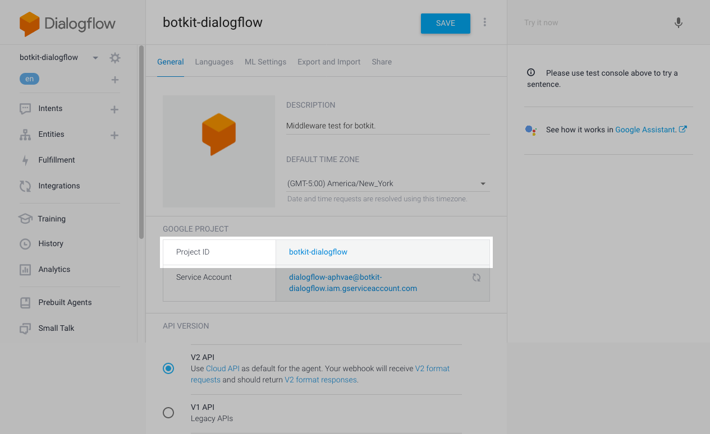

<!-- markdownlint-disable first-line-h1 -->
<!-- markdownlint-disable no-inline-html -->
<!-- markdownlint-disable ul-indent -->

[](https://travis-ci.org/thibaultehrhart/botkit-middleware-dialogflow-v2)

# Botkit Middleware Dialogflow v2

- [Botkit Middleware Dialogflow v2](#botkit-middleware-dialogflow-v2)
    - [Installation](#installation)
    - [Function Overview](#function-overview)
        - [Receive Middleware](#receive-middlewarehttps---githubcom-howdyai-botkit-blob-master-docs-middlewaremdreceive-middleware)
        - [Hear Middleware](#hear-middlewarehttps---githubcom-howdyai-botkit-blob-master-docs-middlewaremdhear-middleware)
    - [Usage](#usage)
        - [Create a Dialogflow Agent](#create-a-dialogflow-agent)
        - [Set up authentication](#set-up-authentication)
        - [Configure a Channel](#configure-a-channel)
        - [Bot Setup](#bot-setup)
    - [What it does](#what-it-does)
- [Features](#features)
    - [Options](#options)
    - [Entities](#entities)
    - [Language](#language)
    - [Debugging](#debugging)
- [Change Log](#change-log)
- [Credit](#credit)
- [License](#license)

This middleware plugin for [Botkit](http://howdy.ai/botkit) allows developers to integrate [Google Dialogflow](https://dialogflow.com/) (formerly [api.ai](https://api.ai)) with social platforms like Slack, Facebook and Twilio.

Dialogflow's Natural Language Processing (NLP) platform transforms real-world user input into structured
**intents** and **entities**, and can optionally trigger **actions** and **fulfillment (webhooks)**. Configuration
and training are done in the convenient and powerful [Dialogflow Console](https://console.dialogflow.com/), with
the results being immediately available to your bot.

## Installation

```bash
npm install https://github.com/thibaultehrhart/botkit-middleware-dialogflow-v2 --save
```

## Function Overview

### [Receive Middleware](https://github.com/howdyai/botkit/blob/master/docs/middleware.md#receive-middleware)

*   `middleware.receive`: used to send the message content to Dialogflow, and add results to the message object.

### [Hear Middleware](https://github.com/howdyai/botkit/blob/master/docs/middleware.md#hear-middleware)

*   `middleware.hears`: matches intent names as configured in [Dialogflow Console](https://console.dialogflow.com/)
*   `middleware.action`: matches action names configured in [Dialogflow Console](https://console.dialogflow.com/)

## Usage

### Create a Dialogflow Agent

To get started, [sign up for an account](https://console.dialogflow.com/api-client/#/login), and explore the
[Dialogflow Console](https://console.dialogflow.com/).

Next, create an [agent](https://dialogflow.com/docs/agents). Agents represent your bots' NLU (Natural Language
Understanding). Your bot will interact with your agent through the [Dialogflow API](https://dialogflow.com/docs/reference/agent/).

Note the _Google Project ID_ that can be found in the [agent settings](https://dialogflow.com/docs/agents#settings); this will be required by your bot.

<p align="center">
  
</p>

### Set up Google Cloud authentication

[Set up authentication with a service account](https://cloud.google.com/docs/authentication/getting-started) so you can access the API.

### Configure a Channel

This document shows code snippets using [Slack](https://github.com/howdyai/botkit/blob/master/docs/readme-slack.md) with the middleware. See the `examples` folder for how to configure a basic bot on your preferred service.

### Bot Setup

Let's walk through the code in the `examples/slack_bot.js` file.

Let's start with Botkit. That's the main engine.

```javascript
var Botkit = require('botkit');
```

Create a Slack controller using Botkit:

```javascript
var slackController = Botkit.slackbot({
    debug: true,
});
```

Spawn a Slack bot using the controller:

```javascript
var slackBot = slackController.spawn({
    token: process.env.token,
});
```

Create a middleware object which we'll be attaching to the controller:

```javascript
var options = {
    projectId: process.env.dialogflow,
};
var dialogflowMiddleware = require('botkit-middleware-dialogflow-v2')(options);
```

Tell your Slackbot to use the middleware when it receives a message:

```javascript
slackController.middleware.receive.use(dialogflowMiddleware.receive);
slackBot.startRTM();
```

Finally, make your bot listen for the intent you configured in the Dialogflow Agent. Notice we
are listening for `hello-intent` - that's the name we gave the intent in the [Dialogflow Console](https://console.dialogflow.com/).

Patterns can be provided as an array or a comma separated string containing a list of regular expressions to match.

```javascript
// listen for literal string 'hello-intent' (case insensitive)
slackController.hears('hello-intent', 'direct_message', dialogflowMiddleware.hears, function(
    bot,
    message
) {
    bot.reply(message, 'Hello!');
});
```

or

```javascript
// listen for literal string 'hello-intent', or anything beginning with "HELLO" (case insensitive)
slackController.hears(
    ['hello-intent', /^HELLO.*/i],
    'direct_message',
    dialogflowMiddleware.hears,
    function(bot, message) {
        bot.reply(message, 'Hello!');
    }
);
```

or

```javascript
// listen for comma-separated 'hello-intent' or 'greeting-intent'
slackController.hears(
    'hello-intent,greeting-intent',
    'direct_message',
    dialogflowMiddleware.hears,
    function(bot, message) {
        bot.reply(message, 'Hello!');
    }
);
```

## What it does

The middleware parses the Dialogflow API response and updates the message object. The raw result of the middleware call to [https://api.dialogflow.com/v1/query](https://dialogflow.com/docs/reference/agent/query) endpoint is made available on the `nlpResponse` property of the message.

The full set of properties available after processing include:

*   `message.intent` for any named intents found as defined in Dialogflow
*   `message.entities` for any language entities defined in Dialogflow (dates, places, etc)
*   `message.fulfillment` for Dialogflow specific speech fulfillment
*   `message.confidence` for the confidence interval
*   `message.nlpResponse` for the raw Dialogflow response.

Here is a diff of a message object, before and after middleware processing.

<p align="center">
  
</p>
<br>

# Features

## Options

When creating the middleware object, pass an options object with the following parameters.

| Property           | Required | Default        | Description                                                                                                                                                                                                                          |
| ------------------ | :------- | :------------: | :----------------------------------------------------------------------------------------------------------------------------------------------------------------------------------------------------------------------------------- |
| projectId          | Yes      | N/A            | Google Project ID, from the Dialogflow Console.                                                                                                                                                                                    |
| ignoreType         | No       | 'self_message' | Skip Dialogflow processing if the `type` matches the pattern. Useful to avoid unneccessary API calls. Patterns can be provided as a string, regex, or array of either.                                                               |
| minimum_confidence | No       | 0.5            | Dialogflow returns a confidence (in the range 0.0 to 1.0) for each matching intent. This value is the cutoff - the `hears` and `action` middleware will only return a match for confidence values equal or greather than this value. |
| sessionIdProps | No | ['user', 'channel'] | Session ID's help Dialogflow preserve context across multiple calls. By default, this session ID is an MD5 hash of the `user` and `channel` properties on the `message` object. If you'd like to use different properties, provide them as a string or array or strings. If none of the desired properties are available on a `message`, the middleware will use a random session ID instead. 

## Entities

Dialogflow has the ability to extract entities (dates, places, etc) from user input. If you have configured your Agent this way,
any entities found will be available on the message.entities property.

## Language

Dialogflow supports [multi-language agents](https://dialogflow.com/docs/multi-language). If the `message` object has a `lang` value set,
the middleware will send it to Dialogflow and the response will be in that language, if the agent supports it.

By default, Botkit `message` objects do not have a langauge specified, so Dialogflow defaults to `en`.

For example, to invoke the Dialogflow agent in French, set your `message` as such:

```javascript
message.lang = 'fr';
```

## Debugging

To enable debug logging, specify `dialogflow-middleware` in the `DEBUG` environment variable, like this:

```bash
DEBUG=dialogflow-middleware node your_awesome_bot.js
```

By default, objects are only logged to a depth of 2. To recurse indefinitely, set `DEBUG_DEPTH` to `null`, like this:

```bash
DEBUG=dialogflow-middleware DEBUG_DEPTH=null node your_awesome_bot.js
```

# Change Log

*   pre-fork as botkit-middleware-dialogflow-v2
    *   initial release

# Credit

Forked from [botkit-middleware-dialogflow](https://github.com/jschnurr/botkit-middleware-dialogflow). Thanks to
[@jschnurr](https://github.com/jschnurr) for the original work.

# License

This library is licensed under the MIT license. Full text is available in LICENSE.
